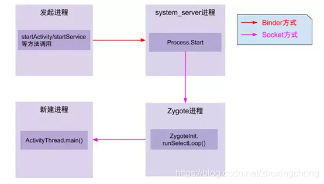
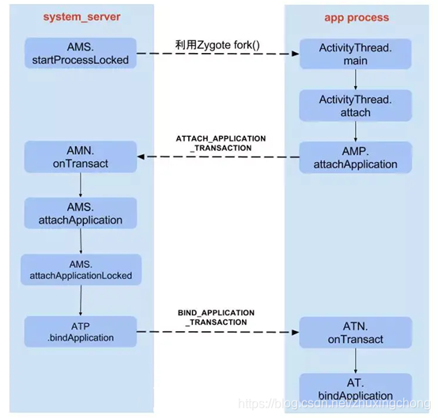

### Android面经

[toc]

## 一、App启动流程（原生Launcher、原生systemui）

[参考链接](https://blog.csdn.net/zhuxingchong/article/details/117931317)

#### ①主要类介绍 ####

***1.1 zygote***

Android系统zygote是一个进程的名字，在Linux System里面，所有的进程都是由==init==进程fork出来的，我们的zygote进程也不例外。

系统里面的第一个zygote进程运行之后，在这之后再开启App，就相当于开启一个新的进程。而为了实现资源共用和更快的启动速度，Android系统开启新进程的方式，是通过fork第一个zygote进程实现的。

*** 2.2 System_server***

SystemServer也是一个进程，而且是由zygote进程fork出来的。知道了SystemServer的本质，这个进程是Android Framework里面两大非常重要的进程之-—另外一个进程就是上面的zygote进程。SystemServer非常重要,因为系统里面重要的服务都是在这个进程里面开启的，比如ActivityManagerService、PackageManagerService、WindowManagerService。

***2.3 ActivityManagerService***

ActivityManagerService，简称AMS，服务端对象，负责系统中所有Activity的生命周期。ActivityManagerService进行初始化的时机很明确，就是在SystemServer进程开启的时候，就会初始化ActivityManagerService。

#### ②启动流程 ####

**2.1 创建进程**

①先从Launcher的startActivity()方法，通过Binder通信，调用ActivityManagerService的startActivity方法。

②一系列折腾，最后调用startProcessLocked()方法来创建新的进程。

③该方法会通过前面讲到的socket通道传递参数给Zygote进程。Zygote孵化自身。调用ZygoteInit.main()方法来实例化ActivityThread对象并最终返回新进程的pid。

④调用ActivityThread.main()方法，ActivityThread随后依次调用Looper.prepareLoop()和Looper.loop()来开启消息循环。

①App发起进程：当从桌面启动应用，则发起进程便是Launcher所在进程；当从某App内启动远程进程，则发送进程便是该App所在进程。发起进程先通过binder发送消息给system_server进程；

②system_server进程：调用Process.start()方法，通过socket向zygote进程发送创建新进程的请求；

③zygote进程：在执行ZygoteInit.main()后便进入runSelectLoop()循环体内，当有客户端连接时便会执行ZygoteConnection.runOnce()方法，再经过层层调用后fork出新的应用进程；

④新进程：执行handleChildProc方法，最后调用ActivityThread.main()方法。

**2.2 绑定Application**

上面创建进程后，执行ActivityThread.main()方法，随后调用attach()方法。

将进程和指定的Application绑定起来。这个是通过上节的ActivityThread对象中调用bindApplication()方法完成的。该方法发送一个BIND_APPLICATION的消息到消息队列中, 最终通过handleBindApplication()方法处理该消息. 然后调用makeApplication()方法来加载App的classes到内存中。

**2.3显示app界面**

经过前两个步骤之后, 系统已经拥有了该application的进程。 后面的调用顺序就是普通的从一个已经存在的进程中启动一个新进程的activity了。

实际调用方法是realStartActivity(), 它会调用application线程对象中的scheduleLaunchActivity()发送一个LAUNCH_ACTIVITY消息到消息队列中, 通过 handleLaunchActivity()来处理该消息。在 handleLaunchActivity()通过performLaunchActiivty()方法回调Activity的onCreate()方法和onStart()方法，然后通过handleResumeActivity()方法，回调Activity的onResume()方法，最终显示Activity界面。

## 常见相关问题

##### SystemServer系统服务进程是如何创建的？Launcher进程如何被创建的？
是由Zygote进程fork而来

##### Launcher启动入口在哪儿？
ActivityManagerService的systemReady函数就是启动Launcher的入口。

##### 系统如何识别Launcher应用？
android.intent.category.HOME

##### 如何开发一个桌面Launcher应用？
android.intent.category.HOME；
android.intent.category.DEFAUlT。

##### Android应用进程的的入口类？
ActivityThread

##### 为什么Activity必须在清单文件中注册？
ActivityStarter会做各种启动前检查。

***

## 二、文件管理器业务开发

### 1、需求分析

文件浏览：文件夹及文件操作增删查改；文件分类：文本、图片、音乐、视频、其他

文件读取：调用系统可执行程序

### 2、应用权限

一般需要存储读取写入等权限，系统应用配置systemuid即可，普通应用需要动态申请

### 3、应用界面

Activity主界面，RecycleView+fragment切换浏览界面

### 4、系统文件读取

Android自身有一个媒体库开机后会对媒体文件进行扫描，直接从媒体库读取比较方便，系统消耗也比较小

也可以直接获取文件存储路径遍历目录文件

有时需要挂载文件权限，或者需要系统开放selinux权限

### 5、app架构

* UI和功能分离，MVVM架构一些必要和公共变量存放VM里，把一些通用接口抽离出来，新建一个模块去实现
* 函数命名，文件层级按照功能划分
* 渠道划分特定资源从渠道获取

